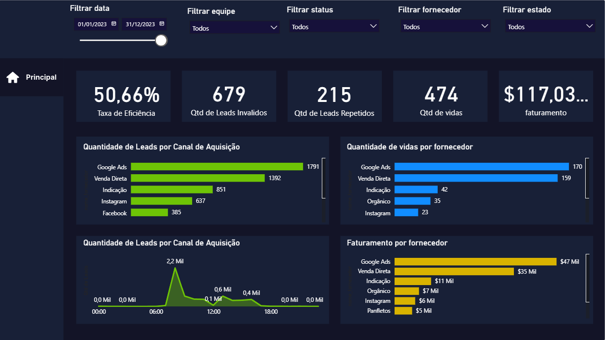

# Análise de Leads

## Objetivo

Este relatório fornece uma visão geral das vendas e leads , com o objetivo de analisar o desempenho de equipes de vendas e avaliar a eficiência de campanhas de marketing. O público-alvo são as equipes de Vendas e Marketing.

## Fonte dos Dados

As fontes de dados utilizadas incluem múltiplos arquivos Excel e uma função de calendário automática:

Excel - base_leads.xlsx

Excel - base_vendas.xlsx

Excel - base_mkt.xlsx

Excel - Planilha de ddds.xlsx

CALENDARAUTO()

## Dashboard

### Visualização Estática

## Processo de Análise

* **Limpeza:** Foram realizados diversos tratamentos nos dados, como a correção de erros de digitação (ex: "Apaixndo por dado" para "Apaixonado por Dados"), a padronização de textos (ex: "Fb" para "Facebook") e a substituição de erros por valores padrão (ex: ddd nulo por -1).
* **Modelagem:** Foi criado um modelo de dados com tabelas fato (fLeads, fVendas, fMarketing) e tabelas dimensão (dimEstado, dimEquipe, dimFornecedor, dimStatus, dimCalendario) , que se relacionam para permitir análises detalhadas.
* **Métrica:** A Taxa de Eficiência foi calculada com uma medida DAX para avaliar o aproveitamento dos leads :

Taxa de Eficiência = DIVIDE([Qtd de Leads Aproveitados], [Qtd de Leads]).
