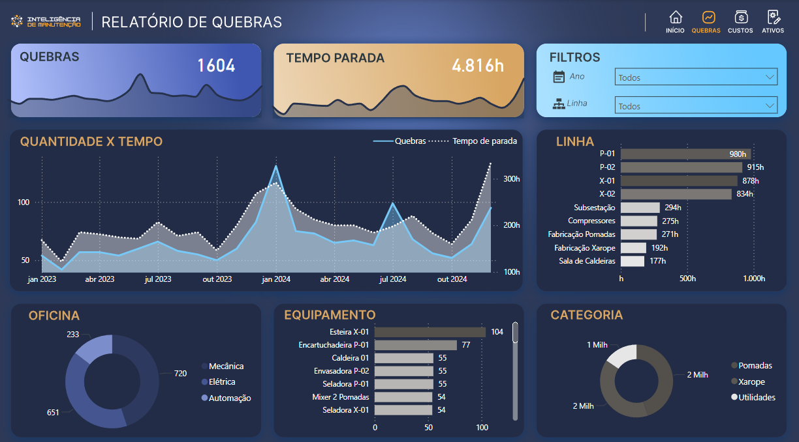
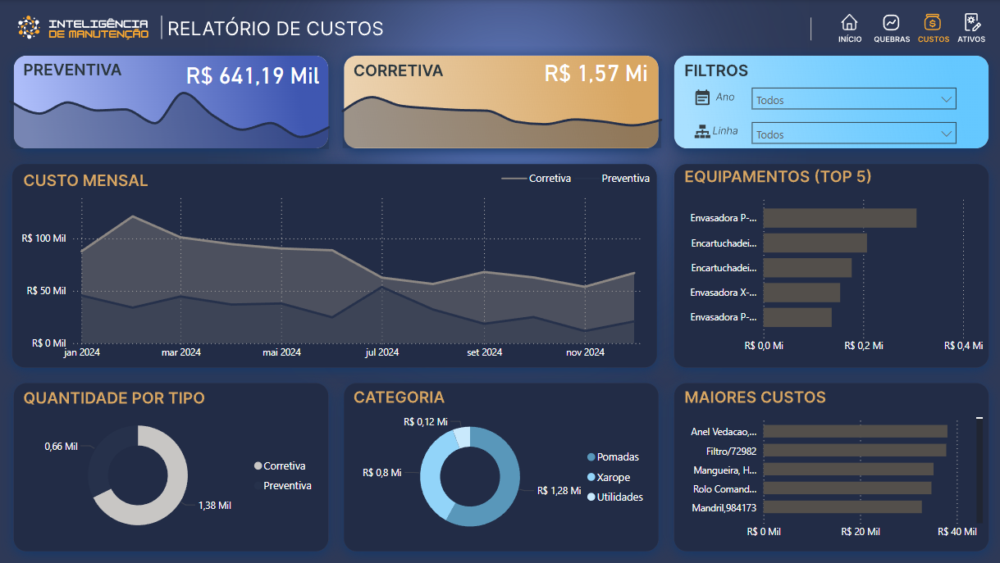
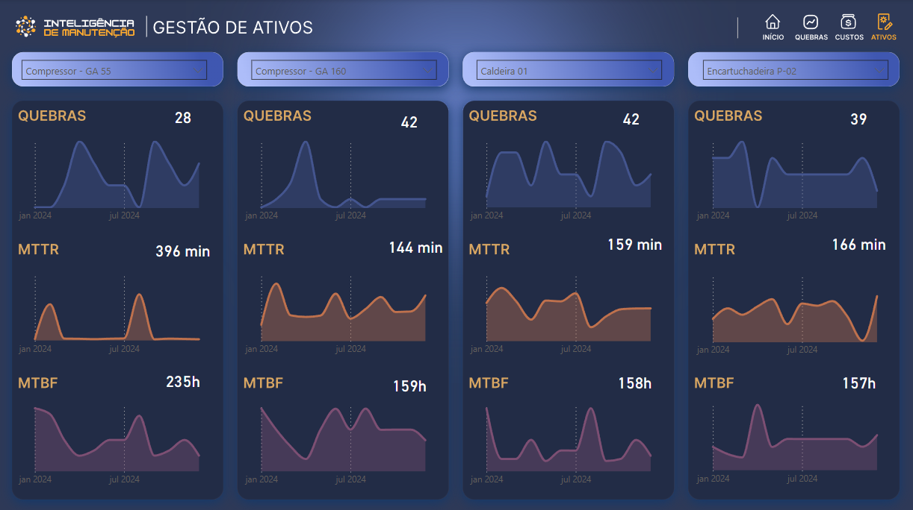

# Análise de Quebras e Custos de Manutenção

## Objetivo

Este relatório oferece uma análise detalhada das quebras de equipamentos e seus custos associados. Ele é direcionado a Gerentes de Manutenção e Produção e serve para analisar os custos de manutenção preventiva e corretiva, além de acompanhar os indicadores de desempenho dos equipamentos.

## Fonte dos Dados

As informações foram extraídas das seguintes fontes de dados:

OS_Aula01.csv

Ativos.csv

Custos.csv

OS.csv

Tempo Produção.csv

Uma tabela de calendário gerada com a função

CALENDAR do DAX.

## Dashboard

### Visualização Estática

## Processo de Análise

* **Limpeza:** O tratamento dos dados incluiu a transformação de colunas na tabela de tempo de produção, convertendo múltiplos campos de data em um formato de linhas para facilitar a análise temporal (Unpivot Columns).
* **Modelagem:** Foi implementado um modelo de dados com tabelas de fatos (fCustos, fOS, fTempoProducao) e dimensões (dAtivos, dCalendario). As tabelas de fatos se conectam à dimensão de ativos (

dAtivos) pela coluna de localização e à dimensão de calendário (dCalendario) por meio dos campos de data.

* **Métrica:** O relatório calcula importantes indicadores de manutenção (KPIs), como o MTTR (Tempo Médio para Reparo) e o MTBF (Tempo Médio Entre Falhas), utilizando as seguintes fórmulas DAX:

MTTR:

(60 * [Tempo_corretiva])/[OS_Qtde]

MTBF:

([TempoProducaoMedida]-[Tempo_corretiva])/fOS[OS_Qtde].
