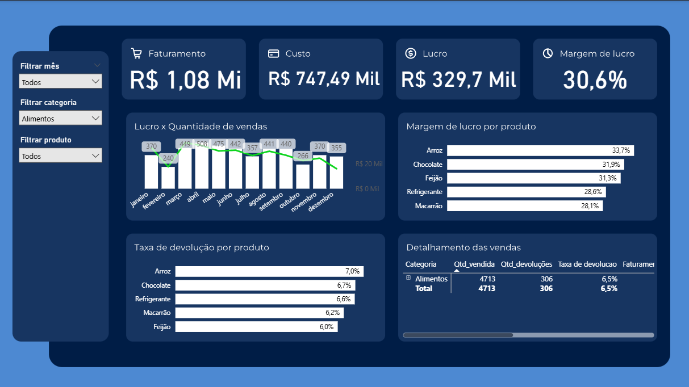

# Análise de Vendas

## Objetivo

Este relatório fornece uma visão detalhada das vendas, incluindo faturamento, custo, lucro e margem de lucro, além de informações sobre a quantidade vendida e devoluções. O público-alvo são Gerentes de Vendas e Analistas de Negócios , e o relatório pode ser usado para análises de desempenho de vendas e identificação de tendências de devoluções.

## Fonte dos Dados

A fonte de dados é uma planilha do Excel chamada "Base de Dados de Vendas", que contém informações sobre data da venda, categoria, produto, quantidade vendida e preço unitário.

## Dashboard

### Visualização Estática

## Processo de Análise

* **Limpeza:** O processo de tratamento dos dados envolveu a criação de colunas calculadas para enriquecer a análise, como "Custo_total", "Qtd_sem_devolucoes" e "Faturamento_real".
* **Modelagem:** A modelagem de dados é composta pela tabela principal "Vendas" , que se relaciona com uma tabela de calendário automática para permitir análises baseadas em datas.
* **Métrica:** Uma das principais métricas utilizadas é a "Margem_de_lucro", calculada com a fórmula DAX: DIVIDE([Lucro],[Faturamento (sem devolucoes)]).
