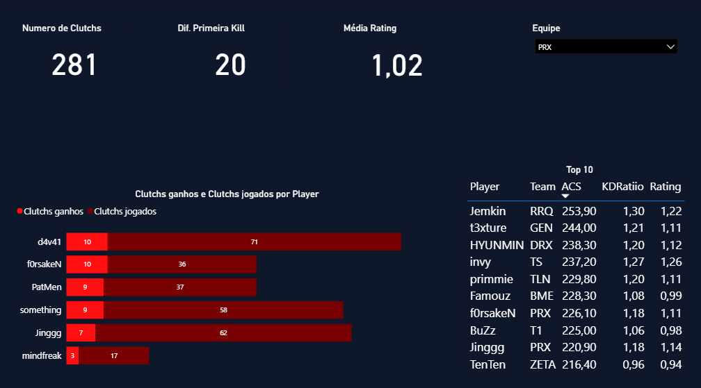

# Análise de Estatísticas do Valorant(em andamento)

## Objetivo

Este relatório fornece uma visão detalhada das estatísticas do jogo Valorant. Ele é destinado a jogadores e equipes de Valorant e pode ser utilizado para a análise de desempenho de jogadores e para a comparação de estatísticas entre equipes.

## Fonte dos Dados

As informações foram extraídas de dois arquivos CSV principais:

Um arquivo com as estatísticas dos jogos da região do Pacífico (Pacific).

Um arquivo dimensional com informações sobre as equipes (DimTeam).

## Dashboard

### Visualização Estática

## Processo de Análise

* **Limpeza:** O processo de tratamento dos dados incluiu a separação da coluna "Player" original em duas novas colunas, "Team" e "Player_name", para permitir a vinculação com a tabela de equipes. Além disso, foram removidos caracteres como "." de colunas numéricas para garantir a correta conversão dos tipos de dados.
* **Modelagem:** Foi criado um modelo de dados simples, onde a tabela de fatos Pacific (contendo as estatísticas) se conecta à tabela de dimensão DimTeam (contendo os nomes das equipes) por meio da coluna IdTeam.
* **Métrica:** Uma das principais métricas do relatório é o Diferencial de Kills, que mede a performance nos duelos iniciais da rodada. A métrica é calculada com a seguinte fórmula DAX:

SUM(Pacific[FK]) - SUM(Pacific[FD]).
