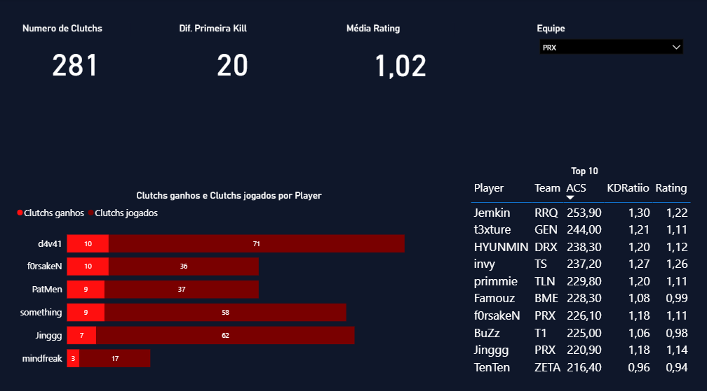

# Análise de Estatísticas do Valorant

## Objetivo

Este projeto fornece uma análise detalhada e profunda das estatísticas do jogo Valorant, através da criação de um Dashboard em Power BI. Voltado para analistas de desempenho, treinadores, gerentes de equipes e entusiastas do cenário competitivo, o painel centraliza as avaliações de performances individuais, coletivas e comparações de estatísticas entre regiões e torneios.

O relatório é modelado com uma arquitetura de dados robusta, mesclando dados de arquivos locais com um banco de dados relacional (PostgreSQL) para construir o histórico global.

## Fonte dos Dados

As informações foram extraídas e integradas a partir de múltiplas fontes:
* **Banco de Dados PostgreSQL Local (`public.vlr_stats_players`):** Arquivo central que armazena as estatísticas históricas dos jogadores de Valorant. Esta base suporta a construção das Tabelas de Dimensão e de Fato globais para análise consolidada de diversos torneios e cenários geográficos.
* **Arquivo CSV (`vct pacific stage 1.csv`):** Base contendo dados brutos e granulares da VCT Pacific Stage 1. Submetido a extensas transformações estruturais (Power Query) para permitir vínculo com as chaves-primárias de Equipes.

## Dashboard e Visualização

### Visualização Estática

## Processo de Análise e ETL (Power Query / Linguagem M)

Para que a visualização final fosse íntegra, dezenas de transformações foram desenvolvidas. As etapas de Data Preparation foram aplicadas em múltiplas tabelas, tais como:
* **Padronização Tipográfica:** Substituição de pontos por vírgulas em indicadores como `Rating`, `ACS` (e dezenas de outras), correção de formatação percentual e alteração assertiva de Tipos de Dados para cálculos precisos de performance de combate.
* **Divisão e Mesclagem de Dimensões:** Separação do nome do Jogador e os sufixos de Equipe em colunas distintas para padronização. Construção de IDs sequenciais nas consultas para manter a arquitetura Estrela (*Star Schema*).

## Modelagem Relacional

A modelagem reflete relacionamentos complexos formados pelas seguintes tabelas geradas no tratamento, conectando múltiplas dimensões a fatos independentes entre si (Contexto "Pacific" x "Global Histórico"):

**Tabelas Fato:**
* `FatoValorant`: Tabela histórica focada na análise global das estatísticas gerais. Contém relacionamentos que ramificam em `DimAno`, `DimEquipe` (que se conecta a `DimRegiao`) e `DimCampeonato`.
* `Pacific`: Fato dedicada ao cenário de VCT Pacific Stage 1, com foco granular em rodadas (Rnd), interações diretas (FK, FD) e vitórias em desvantagem, relacionada com as Dimensões.

**Tabelas de Dimensão (Star Schema):**
* `DimTeam` (Equipes VCT Pacific).
* `DimEquipe` (Equipas do Global).
* `DimRegiao` (Regiões de Campeonato).
* `DimAno` e `DimCampeonato`.

## Principais KPIs (DAX)

Para análises de performance, sete métricas críticas foram construídas baseadas em DAX com foco na VCT e em contextos Históricos:

* **FK Diferencial (VCT e Global):** Avalia a efetividade em engajamentos iniciais, calculando a diferença líquida entre First Kills (FK) e First Deaths (FD) `(SUM(FK) - SUM(FD))`.
* **Média Rating (VCT e Global):** Média global das avaliações dos jogadores para classificar o grau de impacto tático deles em um jogo.
* **Total Clutches (VCT e Global):** Representa a somatória de rounds quando o jogador/equipe se encontrava sobre desvantagem numérica.
